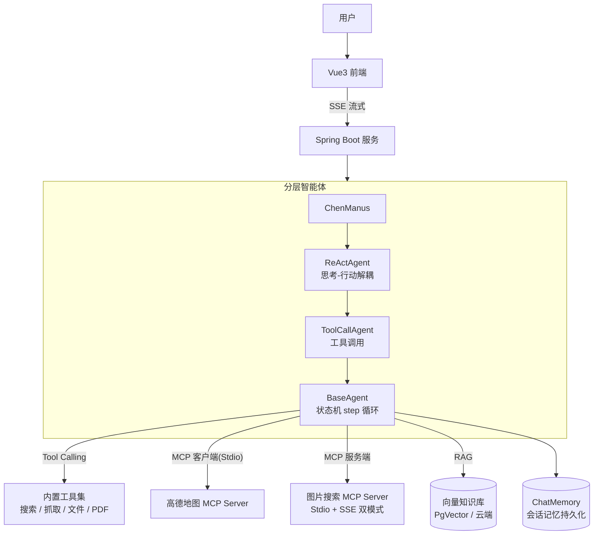

# 寰旅智行 AI

**基于 Spring AI 的企业级 AI 旅行规划智能体** —— 分层智能体架构 · 全流程 RAG · Tool Calling · 双侧 MCP 集成

    

> 用户以自然语言提出旅行需求，智能体基于 ReAct 模式自主规划，调用联网搜索、地图查询、PDF 生成等工具，产出一份完整的行程攻略文档。

## 系统架构



## 核心特性

### 1. 分层智能体架构（参考 OpenManus）

| 层 | 职责 |
|---|---|
| `BaseAgent` | `AgentState` 状态机（IDLE / RUNNING / FINISHED / ERROR）驱动 step 循环，限制最大步数防无限调用 |
| `ReActAgent` | 思考（think）与行动（act）解耦，每步先决策是否调用工具再执行 |
| `ToolCallAgent` | 统一封装 Tool Calling 请求与结果解析 |

**扩展性设计**：新增工具仅需注册 `ToolCallback` 即可接入，零侵入核心流程。

### 2. 全流程 RAG 知识库

- `MarkdownDocumentReader` 文档读取 → `TokenTextSplitter` 向量化切片入库
- `KeywordMetadataEnricher` 自动提取关键元信息，支持精确检索
- 自研 `RagAdvisorFactory` 封装 Advisor 构建流程，检索增强与业务解耦
- 支持**本地 PgVector** 与**阿里云百炼云端知识库**双部署

### 3. 双侧 MCP 集成

- **MCP 客户端**：以本地 Stdio 方式接入高德地图 MCP，AI 基于真实地理位置给出景点与路线建议
- **MCP 服务端**：基于 Spring AI MCP Server 自研图片搜索服务（Pexels API），实现 **Stdio 与 SSE 双传输模式**，适配本地进程调用与远程部署两种场景

### 4. SSE 流式响应

`SseEmitter` 流式输出 + `CompletableFuture` 异步化推理任务，避免长任务阻塞 Tomcat 工作线程，推理过程实时推送前端。

### 5. 会话记忆

`ChatMemory` 多轮对话记忆 + 文件级持久化，会话间相互隔离。

## 工具集

| 工具 | 能力 |
|---|---|
| WebSearchTool | 联网搜索（SearchAPI） |
| WebScrapingTool | 网页内容抓取（jsoup） |
| FileOperationTool | 文件读写 |
| PDFGenerationTool | 行程文档 PDF 生成（iText） |
| ResourceDownloadTool | 资源下载 |
| TerminalOperationTool | 终端命令执行 |
| TerminateTool | 任务终止信号 |

## 快速开始

```bash
# 1. 注入密钥（环境变量，避免硬编码）
export DASHSCOPE_API_KEY=你的灵积APIKey
export SEARCH_API_KEY=你的SearchAPI密钥

# 2. 启动后端（需先准备 PgVector 数据库）
mvn spring-boot:run

# 3. 启动前端
cd ai-chat-frontend && npm install && npm run dev
```

> `application-prod.yml`（默认激活）中的密钥均从环境变量读取；本地调试可将真实密钥写入 `application-local.yml`（已被 .gitignore 排除）。

## 项目结构

```
src/main/java/com/chen/chenaiagent
├── agent/        # 分层智能体（BaseAgent / ReActAgent / ToolCallAgent / ChenManus）
├── advisor/      # 自定义 Advisor（日志、Re-Reading）
├── app/          # 业务应用
├── chatmemory/   # 会话记忆持久化
├── controller/   # 接口层（SSE 流式）
├── rag/          # RAG 全流程（加载 / 切片 / 向量库 / 查询增强）
├── tools/        # Tool Calling 工具集
└── demo/invoke/  # 三种大模型调用方式对比（SDK / Spring AI / LangChain4j）
```

## Roadmap

- [ ] 自建问答评测集，量化 RAG 召回率并调优 chunk / Top-K
- [ ] MCP 服务端接入 Streamable HTTP（新版 MCP 规范推荐的远程传输）
- [ ] Token 用量统计与成本控制面板

---

*本项目为个人学习与工程实践项目，欢迎交流：321289707@qq.com*
